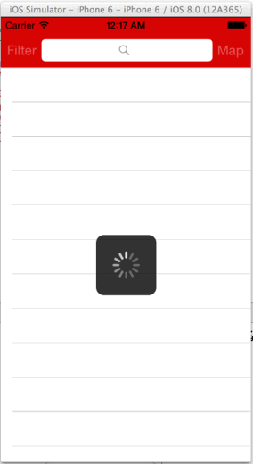

Yelp
=========

An Yelp style app to search for restaurants and businesses.

Time spent: 12 hours

### Required:
#### Search Results Page
* [x] Table rows should be dynamic height according to the content height
* [x] Custom cells should have the proper Auto Layout constraints
* [x] Search bar should be in the navigation bar (doesn't have to expand to show location like the real Yelp app does).

#### Filter page

* [x] The filters you should actually have are: category, sort (best match, distance, highest rated), radius (meters), deals (on/off).
* [x] The filters table should be organized into sections as in the mock.
* [x] You can use the default UISwitch for on/off states.
* [x] Radius filter should expand as in the real Yelp app
* [x] Categories should show a subset of the full list with a "See All" row to expand.
* [x] Clicking on the "Search" button should dismiss the filters page and trigger the search w/ the new filter settings.

### Optional:
* [ ] Infinite scroll for restaurant results.
* [ ] Implement the restaurant detail page.
* [x] Implement map view of restaurant results

Walkthroughs:

## Resources Used

### Pods

* AFNetworking
* BDBOAuth1Manager
* Google-Maps-iOS-SDK
* MBProgressHUD
* Mantle

### APIs

Yelp API
